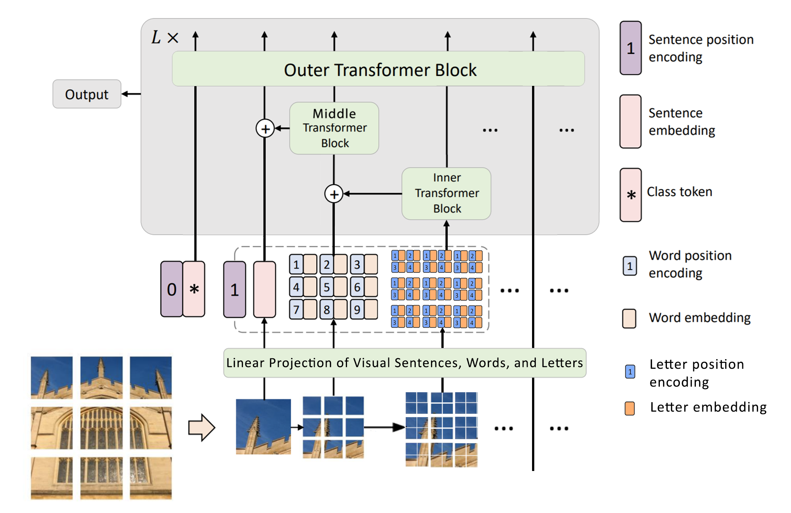

# 🧠 Recursive Transformer in Transformer (RTNT)



This project is a PyTorch reimplementation and extension of the **Transformer in Transformer (TNT)** architecture, applied to the MNIST dataset. We extend the original idea by introducing a **recursive TNT structure** to deepen the model’s ability to capture hierarchical representations in image data.

---

## 🚀 Features

- 🔁 **Recursive TNT blocks** for deeper representation learning  
- 🧱 Modular code structure for clean experimentation  
- 📊 Custom training + evaluation loops with learning rate schedulers  
- 📉 Real-time loss visualization with optional smoothing  
- 🧪 Easily swappable datasets, loss functions, and optimizers

---

## 🛠️ Installation

```bash
git clone https://github.com/yourusername/rtnt.git
cd rtnt
pip install -r requirements.txt
